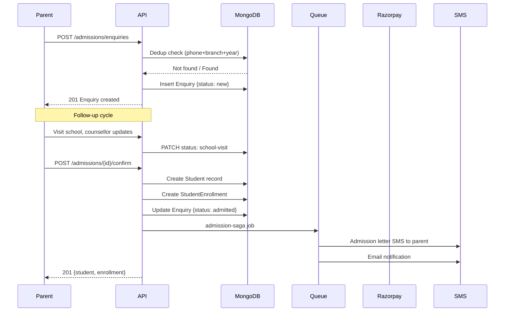

# Admission Workflow

## Sequence Diagram

## Business Rules

1. **Deduplication**: If phone + branch + academic year + status not in [admitted, lost], return existing enquiry.
2. **Admission saga**: Student creation + enrollment + notification must all succeed or compensate.
3. **RTE quota**: Separate workflow with category = 'ews' or 'sc'/'st' tracked via `isRteStudent`.
4. **Sibling discount**: Detected during fee demand generation by matching guardian phone.
5. **Idempotency**: `confirm` endpoint checks for existing student with same admissionNo.

## Exception Scenarios

| Exception | Recovery |
|-----------|----------|
| Payment captured but confirm failed | Webhook retry with idempotency key |
| Duplicate enquiry | Return existing with `{ duplicate: true }` |
| SMS delivery failure | Retry queue with 3 attempts, exponential backoff |
