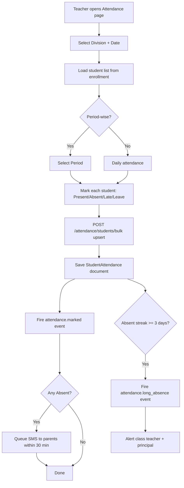

# Attendance Workflow

## Flow Diagram

## Event Consumers

| Event | Consumer | Action |
|-------|----------|--------|
| `attendance.student.absent` | Communication | SMS to parent |
| `attendance.long_absence` | Communication | Alert teacher + principal |
| `leave.approved` | Timetable | Schedule substitution if staff |
