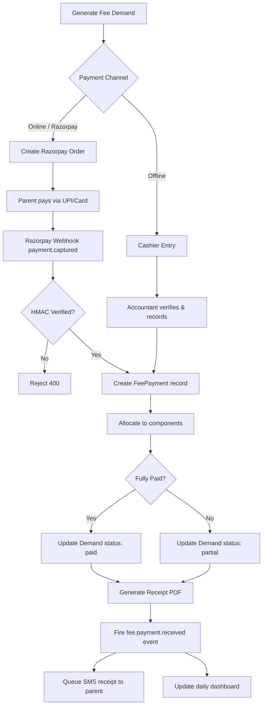

# Fee Collection Workflow

## Flow Diagram

## Business Rules

1. **GST**: Components with `gstApplicable=true` calculate GST separately; tuition is exempt.
2. **Partial payment**: Allocate to components in order (first component filled first).
3. **Cheque**: Recorded in `chequeRegister`; `isBounced` flag triggers reversal workflow.
4. **Late fee**: Auto-calculated when `dueDate` is past; added to `lateFee` field of demand.
5. **Concession**: Requires approval workflow before demand amount is reduced.
6. **Receipt number**: `{prefix}-{6-digit-sequence}` per branch, immutable once issued.

## Rollback Scenarios

| Scenario | Recovery |
|----------|----------|
| Razorpay webhook duplicate | Idempotency check on `gatewayOrderId` |
| Cheque bounce | `isBounced=true`, reverse allocation, re-open demand |
| DB write fails after gateway capture | Idempotency key prevents re-creation on retry |
